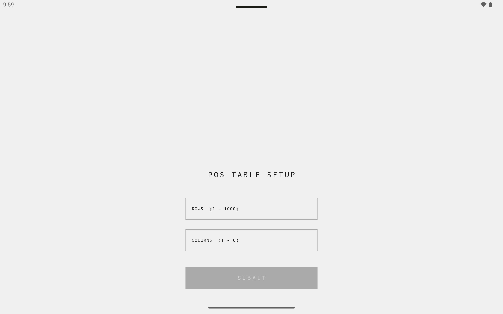
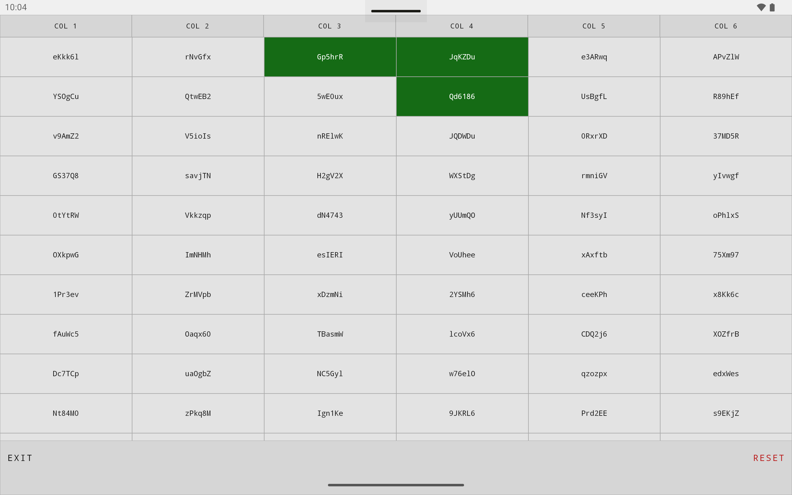

# Tab Application

A tablet-focused Android POS (Point-of-Sale) table management app built with modern Kotlin and Jetpack Compose. Designed to handle a **1 000 × 6 grid of cells** (~6 000 items) at 60 fps on commodity tablet hardware.

---

## Screenshots

| Setup | Table |
|---|---|
|  |  |

---

## Tech Stack

| Layer | Technology |
|---|---|
| UI | Jetpack Compose, Material 3 |
| Architecture | Clean Architecture · MVI · Kotlin Multiplatform |
| Navigation | Navigation 3 (`androidx.navigation3`) |
| DI | Koin 4 |
| Async | Kotlin Coroutines + Flow |
| Collections | `kotlinx-collections-immutable` |
| Language | Kotlin 2.2 |
| Min SDK | 29 · Target SDK 36 |

---

## Architecture

The project is split into four Gradle modules with strictly enforced inward-only dependencies:

```
:app  ──►  :ui  ──►  :domain  ◄──  :data
```

| Module | Type | Responsibility |
|---|---|---|
| `:domain` | Kotlin Multiplatform | Entities, use-case interfaces, repository interfaces — zero Android dependencies |
| `:data` | Kotlin Multiplatform | Repository implementations and data sources |
| `:ui` | Android Library | Compose screens, ViewModels (MVI), Koin wiring |
| `:app` | Android Application | `MainActivity`, `Application` class, Koin bootstrap |

`:domain` and `:data` are KMP modules so the business logic can be shared with other platforms (iOS, Desktop) without changes.

### MVI in `:ui`

Each screen defines a `*MviContract.kt` with three types:
- **State** — `@Immutable data class`, exposed as `StateFlow`
- **Intent** — `sealed interface` of user actions
- **Effect** — `sealed interface` for one-shot events (navigation, toasts)

### Advanced Performance Engineering

Handling a dynamic 6,000-cell grid on mid-range Android tablets requires zero-allocation renders and tight control over Jetpack Compose's recomposition lifecycle:

- **Recomposition Blast-Radius Isolation:** Instead of capturing raw IDs in item loops, cells receive a structural `isEditing: Boolean` and an event-time `isAnyEditingProvider: () -> String?` lambda. When a cell enters edit mode, **only 1 cell recomposes** instead of invalidating the entire visible viewport (~150 cells).
- **$O(1)$ Grid Diffing & Reference Stability:** The domain-to-UI mapping utilizes `runningFold` in the ViewModel. It retains identical state references (`===`) for unchanged cells, enabling the Compose compiler to skip layout and measurement passes completely during fast flings.
- **Theme CompositionLocal Anchoring:** Instantiations of Colors, Typography, and Dimens data classes inside `TabAppTheme` are explicitly wrapped with `remember`. This completely cuts off cascading full-tree invalidations via `staticCompositionLocalOf` during tablet orientation changes or docking events.
- **Node Allocation & Keying Density:** Cell backgrounds and borders bypass layout-node overhead by rendering graphics directly inside `Modifier.drawBehind {}` rather than appending multiple structural layout modifiers. Additionally, the `LazyVerticalGrid` is strictly keyed on unique cell IDs rather than volatile list indices to maximize view-node reuse.

### Concurrency & State Discipline

To support high-frequency multi-touch interactions on physical merchant hardware, the app implements a rigorous multi-threaded safety contract:

- **Shared-Memory Synchronization:** The `InMemoryTableRepository` encapsulates mutations inside a Kotlin Coroutines `Mutex` (`withLock`), preventing state corruption, partial writes, and `ConcurrentModificationException` during concurrent user inputs.
- **Idempotent Asynchronous Commits:** The UI layer relies on a two-layer protection guard inside `TableViewModel` to handle blur/focus-loss events. The active editing ID is cleared **synchronously on the main thread** acting as a latch before the asynchronous UseCase coroutine is launched, cleanly rejecting duplicate execution frames.

### POS-Adapted UI/UX Mechanics

The interface is custom-tailored to meet real-world industrial checkout constraints:

- **Instant Modal Input Locking:** Active text editing locks the surrounding grid into a modal state. Non-editing cells switch to a lightweight, distraction-free `.clickable` listener that instantly requests `focusManager.clearFocus()`, dismissing the virtual keyboard without the artificial 300ms delay inherent in double-tap gestures.
- **Select-All Inline Mechanics:** Double-clicking a cell replaces the static label with a `BasicTextField` driven by a state-managed `TextFieldValue`. The selection is initialized with a full `TextRange(0, length)`, allowing operators to overwrite data instantly with a single touch without hitting backspace.

---

## Getting Started

### Prerequisites

- Android Studio Meerkat or later
- JDK 11+
- Android SDK with API 36

### Clone & Build

```bash
git clone https://github.com/HankOhana/TabApplication.git
cd TabApplication
./gradlew assembleDebug
```

### Run on device / emulator

Open the project in Android Studio and press **Run**, or:

```bash
./gradlew installDebug
```

---

## Development

### Compile checks (faster than a full build)

```bash
# KMP modules only — fastest feedback loop
./gradlew :domain:compileKotlinJvm :data:compileKotlinJvm

# UI module
./gradlew :ui:compileDebugKotlin

# Everything
./gradlew :domain:compileKotlinJvm :data:compileKotlinJvm :ui:compileDebugKotlin
```

> After any Kotlin or Gradle change, run the relevant compile check and fix all errors before committing.

### Tests

```bash
# All JVM unit tests
./gradlew test

# Single test — :domain or :data (KMP JVM target)
./gradlew :domain:jvmTest --tests "com.henadz.sample.tabapplication.domain.usecase.GetTableUseCaseTest"

# Single test — :ui
./gradlew :ui:testDebugUnitTest --tests "com.henadz.sample.tabapplication.ui.table.TableViewModelTest"

# Instrumented tests (device/emulator required)
./gradlew connectedDebugAndroidTest
```

### Lint

```bash
./gradlew lint
```

---

## Project Conventions

- **Dependencies** — all versions live in `gradle/libs.versions.toml`; never inline a version in `build.gradle.kts`.
- **Strings** — all UI copy lives in `UiStrings.kt` (`ui/strings/`); the app does not use `res/values/strings.xml`.
- **Theme** — access via `TabAppTheme.colors`, `TabAppTheme.typography`, `TabAppTheme.dimens`; never via `MaterialTheme.*` directly.
- **Grid bounds** — `GridConstraints` in `:domain` is the single source of truth for valid row/column counts; never hardcode them.
- **DI** — Koin only. Hilt / Dagger are not used.

---